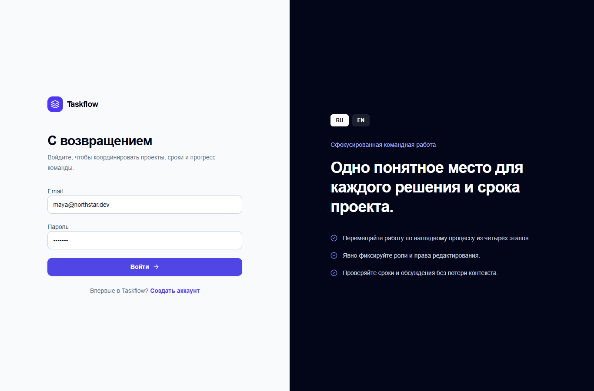

# Taskflow


Taskflow is a portfolio-grade team task manager centered on projects, deadlines, comments, role-aware controls, filters, and a drag-and-drop Kanban workflow. The demo uses typed mock data and local browser persistence while keeping authentication and data access behind replaceable boundaries.

## Live Demo

https://team-task-manager-gilt-eta.vercel.app

## Source Code

https://github.com/Andrey15211/team-task-manager

## Features

- Mock login, registration, logout, and protected application layout
- Workspace dashboard with task and project summaries
- Project create, edit, delete, list, and detail views
- Four-column drag-and-drop Kanban
- Task CRUD with priorities, deadlines, assignees, tags, and comments
- Combined search, status, priority, and assignee filters
- Owner, member, and readonly UI permission modes
- Browser persistence and demo-data reset

## Tech Stack

- Next.js 16 App Router
- React 19 and TypeScript
- Tailwind CSS 4
- dnd-kit
- React Hook Form and Zod
- date-fns
- Vitest and Testing Library

## Localization

- RU/EN support: authentication, navigation, forms, statuses, roles, dates, and demo content
- Default language: Russian
- Language switcher: available on auth screens and in the application header
- Locale preference: persisted in `localStorage`

## Screenshots

### Desktop



### Mobile

Planned path: `docs/screenshots/mobile.png`

### RU/EN example

Planned path: `docs/screenshots/localization.png`

Mobile and localization screenshots will be added after final interactive capture. The current desktop capture shows the public login entry point; an authenticated Kanban capture is also recommended.

## Local Development

```bash
npm install
npm run dev
npm run build
```

The login form is prefilled; any valid email and password of at least six characters creates a mock session.

## Deployment

Deployed on Vercel using the Next.js preset. The mock-data version needs no environment variables; real shared persistence and authorization require a backend such as Supabase.

## What this project demonstrates

- Kanban and task management
- Drag-and-drop state transitions
- CRUD and role-aware UI logic
- Fullstack-like architecture boundaries
- Responsive product application design

## Recommended GitHub Topics

`task-manager` `kanban` `project-management` `nextjs` `typescript` `dnd-kit` `react-hook-form` `zod` `role-based-access` `vercel`
